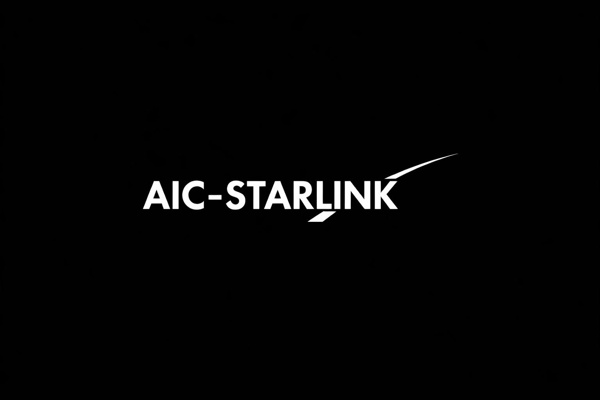

# AIC-Starlink
A research driven and security oriented simulation | @AdaptiveIntelligenceCircle

----
<p align="center">
  
</p>

---- 

## Definition

**AIC-Starlink** is a research-driven and security-oriented simulation framework designed to model, analyze, and defend satellite-based communication networks inspired by Starlink-like architectures.

This repository is part of the broader **Adaptive Intelligence Circle (AIC)** ecosystem, but is intentionally built as a standalone module to allow independent development, testing, and deployment.

---

## Why AIC-Starlink Exists

Satellite internet is not just networking — it is **critical infrastructure**.

AIC-Starlink focuses on:
- Space-to-ground communication resilience
- Cyber + Electronic Warfare threat modeling
- Telemetry-driven anomaly detection
- Adaptive routing and defense policies
- Integration into AIC-Aerospace as a plug-in module

---

## Core Capabilities

### Simulation Layer
- Satellite orbit modeling (abstracted)
- Link budget and signal degradation modeling
- Latency, packet loss, jitter simulation
- Routing and dynamic path selection
- Interference simulation (jamming/spoofing)

### Telemetry Pipeline
- Telemetry ingestion and parsing
- Validation and metric extraction
- Attack signal pattern modeling
- Event-based monitoring

### Detection & Threat Scoring
- Signature-based detection
- Behavioral anomaly detection
- Threat scoring and classification
- Adversary profile mapping

### Defense Engine
- Automatic rerouting policy
- QoS downgrade / isolate policy
- Rollback policies
- Adaptive defense response

### Integration Layer
- AIC plugin API interface
- JSON API adapter
- Event bus adapter for distributed deployment

---

## Repository Structure

- `include/` Public headers for AIC-Starlink SDK
- `src/` Core implementation
- `simulation/` Models for satellite network simulation
- `telemetry/` Telemetry ingestion and validation
- `detection/` Anomaly + signature detection engines
- `defense/` Response policies and mitigation
- `policy/` Compliance, geo-fencing, risk rules
- `threat_intel/` Threat feed and adversary profiles
- `examples/` Demo programs
- `tests/` Unit and integration tests
- `docs/` Architecture and research documentation

---

## Build

### Requirements
- C++23 compiler
- CMake >= 3.20

### Build steps
```bash
mkdir build
cd build
cmake ..
cmake --build . -j
```

### Run example
```bash
./examples/simple_simulation/simple_simulation
./examples/anomaly_detection_demo/anomaly_detection_demo
./examples/defense_response_demo/defense_response_demo

```

--- 

## Security Focus
This repository is built with security-first assumptions:

+ Strict validation
+ Deterministic simulation reproducibility
+ Adversary-aware design
+ Safe defaults in policy systems

See: **SECURITY.md**

## Roadmap 
See : **docs/roadmap.md** 

## Contributing
Contributing are welcome 
See: **Contributing.md**

## Code Of Conduct 
This project follows a strict community standard
See: **CODE_OF_CONDUCT.MD**

## License 
License Under the GPL-3.0 
